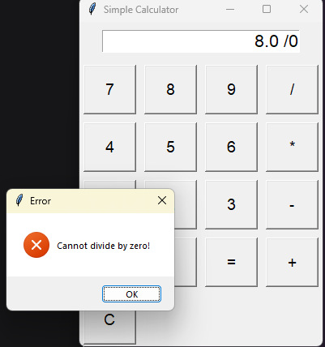

# Simple Calculator


A desktop calculator built with Python and Tkinter for basic arithmetic operations (addition, subtraction, multiplication, division). Developed as part of the MITS Internship, it features a user-friendly GUI with support for both mouse and keyboard inputs, real-time expression display (e.g., "5 + 3"), and error handling for invalid inputs.

## Table of Contents
- [Introduction](#introduction)
- [Features](#features)
- [Installation](#installation)
- [Usage](#usage)
- [Screenshots](#screenshots)
- [Documentation](#documentation)
- [Contributing](#contributing)
- [License](#license)

## Introduction
The Simple Calculator is a lightweight application designed to perform basic arithmetic operations with an intuitive Tkinter GUI. It supports both mouse clicks and keyboard inputs, displays the full expression during input, and provides clear error messages for issues like division by zero. This project was created to fulfill the MITS Internship requirements, showcasing skills in Python, GUI development, and error handling.

## Features
- **Arithmetic Operations**: Addition, subtraction, multiplication, and division.
- **Input Methods**:
  - Mouse: Click buttons for digits, operators, equals, and clear.
  - Keyboard: Use digits, operators, Enter (equals), 'C' (clear), and Backspace (corrections).
- **Real-Time Display**: Shows the full expression (e.g., "5 + 3") before calculating.
- **Error Handling**: Alerts for division by zero and invalid inputs via messagebox.
- **Portable**: Runs on any system with Python and Tkinter (no external dependencies).

## Installation
Follow these steps to set up and run the calculator locally:

1. **Clone the Repository**:
   ```bash
   git clone https://github.com/your-username/simple-calculator.git
   cd simple-calculator
   ```
2. **Ensure Python is Installed**:
   - Requires Python 3.9 or higher. Verify with:
     ```bash
     python --version
     ```
   - Tkinter is included with standard Python installations.
3. **Run the Application**:
   ```bash
   python calculator.py
   ```

## Usage
- **Mouse Input**:
  - Click digits (0-9) and decimal point (.) to enter numbers.
  - Click operators (+, -, *, /) to select an operation.
  - Click '=' to compute the result or 'C' to clear.
- **Keyboard Input**:
  - Type digits, decimal point, and operators.
  - Press Enter for equals, 'C' or 'c' to clear, or Backspace to correct.
- **Example**:
  - Input: Type "5", press "+", type "3", press Enter.
  - Output: Display shows "5 + 3", then "8" after Enter.
  - Try "5 / 0" to see the error message.

## Screenshots
**Expression Display**:

*Caption: GUI showing the expression "5 + 3" during input.*

**Error Handling**:

*Caption: Error message for division by zero.*

## Documentation
Detailed documentation is available in [calculator_documentation.docx](calculator_documentation.docx) (or [calculator_documentation.pdf](calculator_documentation.pdf)), covering the project’s design, implementation, and future scope.

## Contributing
Contributions are welcome! To contribute:
1. Fork the repository.
2. Create a branch: `git checkout -b feature-name`
3. Make changes and commit: `git commit -m "Add feature"`
4. Push to your fork: `git push origin feature-name`
5. Submit a pull request.

Please read [CONTRIBUTING.md](CONTRIBUTING.md) for guidelines (if added later).

## License
This project is licensed under the MIT License. See [LICENSE](LICENSE) for details.

*Last Updated: June 18, 2025*